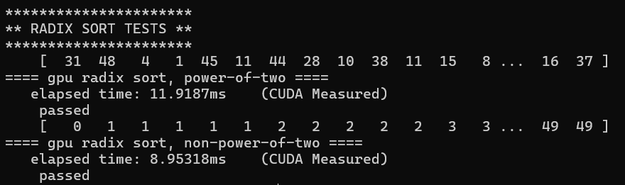
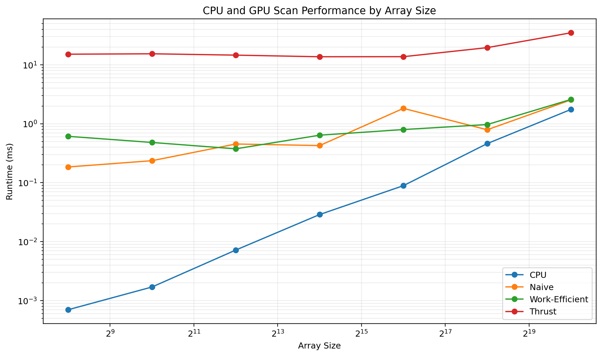
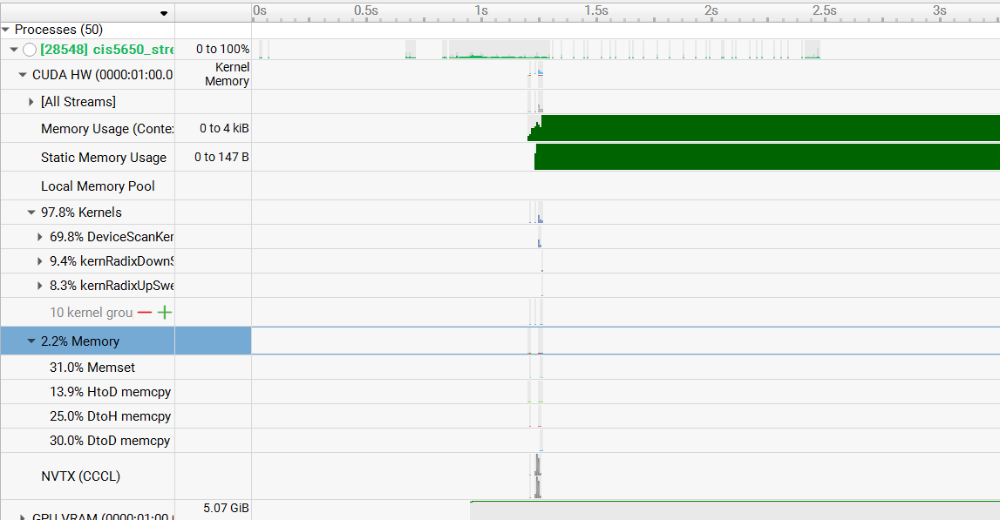

CUDA Stream Compaction
======================

**University of Pennsylvania, CIS 5650: GPU Programming and Architecture, Project 2**

* Yunzhe Deng
  * [LinkedIn](https://www.linkedin.com/in/yunzhedeng), [personal website](https://yunzhedeng.com)
* Tested on: Windows 11, Intel Core i7-10750H @ 2.60GHz, 16 GB RAM, NVIDIA GeForce RTX 2060 (Personal Computer)

## 1. Project Description

This project implements stream compaction and prefix sum (scan) algorithms on both the CPU and GPU using CUDA. Stream compaction is implemented using the map-scan-scatter approach to remove zero-valued elements from an input array.

Here are its features:

- Serial CPU exclusive scan
- CPU stream compaction without scan
- CPU stream compaction using map-scan-scatter
- Naive parallel GPU exclusive scan
- Work-efficient GPU exclusive scan
- Work-efficient GPU stream compaction
- Thrust exclusive scan
- Optimized active-thread scheduling during up-sweep and down-sweep
- GPU radix sort for non-negative integers
- Shared-memory work-efficient scan
- Shared-memory bank-conflict optimization
- Power-of-two and non-power-of-two input support

## 2. Extra Credits

### 2.1 Optimized Work-Efficient GPU Scan

The work-efficient scan uses fewer active threads as the scan moves deeper into the up-sweep and down-sweep. Near the top of the tree, only a small number of threads still have useful work to do.

To reduce wasted work, my implementation calculates the number of active threads for each level instead of launching the same number of blocks every time:

```cpp
int activeThreads = paddedN / (offset * 2);
int blocks = (activeThreads + blockSize - 1) / blockSize;
```

**Why It Is Still Slower Than the CPU**

Even after this optimization, the work-efficient GPU scan was still slower than the serial CPU scan in my tests. The CPU version is just one simple loop that reads the array in order. The GPU version is more complicated because every level of the up-sweep and down-sweep needs another kernel launch. For an array of size `n`, this is about `2 * log2(n)` kernel launches. The GPU version also reads and writes global memory at every level. Since scan only does simple addition, the calculation itself is cheap, so memory access and kernel launch overhead take a large part of the total time.

The GPU also becomes less busy near the top of the scan tree. The number of active threads keeps getting smaller, from `n / 2` to `n / 4`, `n / 8`, and finally only one thread. This means the GPU cannot use much parallelism at the deeper levels. So even though the optimization removes a lot of unnecessary work, the GPU can still be slower than the CPU because of kernel launch overhead, repeated global memory access, synchronization, and low GPU usage near the top of the tree.

### 2.2 Radix Sort

Implemented a GPU radix sort for non-negative integers using the same map-scan-scatter idea from stream compaction. For each bit, the values with a 0 bit are moved to the front and the values with a 1 bit are moved after them. This process is repeated for each bit until the array is sorted. The value of radix sort is that it shows how scan can be reused as a building block for a more complex parallel algorithm.

Example call:

```cpp
StreamCompaction::Radix::sort(SIZE, output, input);
```

Example output:



### 2.3 GPU Scan Using Shared Memory && Hardware Optimization

Implemented another work-efficient scan using shared memory instead of repeatedly accessing global memory during the up-sweep and down-sweep. Each thread loads two elements from global memory into shared memory. The scan is then performed inside shared memory, and the final result is written back to global memory. This reduces the number of global memory accesses during the scan.

Adding padding to the shared-memory indices to reduce shared-memory bank conflicts:

```cpp
int bankOffset = index >> 5;
temp[index + bankOffset]
```

This implementation uses a single CUDA block and supports up to 2048 padded elements.

## 3. Block Size Optimization

### Block Size Performance Results

| Block Size | Naive Scan (ms) | Work-Efficient Scan (ms) |
| ---------: | --------------: | -----------------------: |
|         64 |           2.537 |                    1.153 |
|        128 |            2.44 |                    0.929 |
|        256 |           2.423 |                    0.913 |
|        512 |            2.67 |                     1.43 |

Based on these results, a block size of 256 was selected for the following performance tests.

## 4.  Performance Analysis

### 4.1 Scan Performance by Array Size

#### CPU and GPU Scan Performance Results

| Array Size | CPU (ms) | Naive Scan (ms) | Work-Efficient Scan (ms) | Thrust Scan (ms) |
| ---------: | -------: | --------------: | -----------------------: | ---------------: |
|        256 |   0.0007 |          0.1947 |                    0.611 |            15.11 |
|      1,024 |   0.0017 |           0.236 |                    0.481 |           15.358 |
|      4,096 |   0.0072 |           0.453 |                    0.375 |           14.568 |
|     16,384 |   0.0288 |           0.426 |                    0.639 |           13.677 |
|     65,536 |    0.089 |            1.82 |                    0.796 |           13.712 |
|    262,144 |     0.46 |            0.79 |                    0.968 |           19.517 |
|  1,048,576 |    1.748 |           2.538 |                    2.583 |           34.877 |

### 4.2 Performance Comparison Graph



Both axes are shown on logarithmic scales to make the runtimes easier to compare across different array sizes.

### 4.3 Analysis

The CPU scan is the fastest for most of the tested array sizes. Its runtime increases as the array gets larger, which makes sense because the CPU version is a simple loop that reads the array once.

The Naive GPU scan has a much larger fixed cost for small arrays. It also does more work because every scan step processes many elements again. It needs multiple kernel launches and repeatedly reads and writes global memory. Because of this, both kernel launch overhead and memory I/O are important bottlenecks. The actual addition operation is very cheap. Some small changes in the GPU timings are not perfectly monotonic, which is likely caused by normal runtime variation and differences in GPU utilization.

The Work-Efficient GPU scan does less total computation than the Naive version, so it performs better at several array sizes. However, it still needs multiple up-sweep and down-sweep kernel launches and accesses global memory at every level. Near the top of the scan tree, only a few threads are active, so the GPU is not fully used. Therefore, its main bottlenecks are global memory access, kernel launch overhead, synchronization, and low occupancy at deeper levels.

The Thrust scan is much slower than the other implementations in the tests. Its runtime stays relatively high even for small arrays, which suggests that there is a large fixed overhead. The Nsight Systems timeline shows an internal `DeviceScanKernel`, CUDA API activity, and several memory operations. This suggests that Thrust has additional setup and memory overhead besides the scan computation itself. Since scan only performs simple additions, this extra overhead can become a large part of the total runtime.

Nsight Systems Report



## 5. Test Output

In addition to the provided tests, I added power-of-two and non-power-of-two correctness tests for the GPU radix sort and shared-memory scan implementations.

```text
****************
** SCAN TESTS **
****************
    [  34  23   7  45   1   1  18   0  26   8  13  13  36 ...  39   0 ]
==== cpu scan, power-of-two ====
   elapsed time: 0.0007ms    (std::chrono Measured)
    [   0  34  57  64 109 110 111 129 129 155 163 176 189 ... 5889 5928 ]
==== cpu scan, non-power-of-two ====
   elapsed time: 0.0007ms    (std::chrono Measured)
    [   0  34  57  64 109 110 111 129 129 155 163 176 189 ... 5808 5835 ]
    passed
==== naive scan, power-of-two ====
   elapsed time: 0.201664ms    (CUDA Measured)
    passed
==== naive scan, non-power-of-two ====
   elapsed time: 0.0504ms    (CUDA Measured)
    passed
==== work-efficient scan, power-of-two ====
   elapsed time: 0.285632ms    (CUDA Measured)
    passed
==== work-efficient scan, non-power-of-two ====
   elapsed time: 0.274752ms    (CUDA Measured)
    passed
==== thrust scan, power-of-two ====
   elapsed time: 14.0448ms    (CUDA Measured)
    passed
==== thrust scan, non-power-of-two ====
   elapsed time: 1.54051ms    (CUDA Measured)
    passed
==== shared-memory scan, power-of-two ====
   elapsed time: 0.600352ms    (CUDA Measured)
    passed
==== shared-memory scan, non-power-of-two ====
   elapsed time: 0.066016ms    (CUDA Measured)
    passed

*****************************
** STREAM COMPACTION TESTS **
*****************************
    [   0   1   1   1   3   1   0   0   2   0   1   1   2 ...   3   0 ]
==== cpu compact without scan, power-of-two ====
   elapsed time: 0.0009ms    (std::chrono Measured)
    [   1   1   1   3   1   2   1   1   2   3   1   1   3 ...   3   3 ]
    passed
==== cpu compact without scan, non-power-of-two ====
   elapsed time: 0.001ms    (std::chrono Measured)
    [   1   1   1   3   1   2   1   1   2   3   1   1   3 ...   3   3 ]
    passed
==== cpu compact with scan ====
   elapsed time: 0.0017ms    (std::chrono Measured)
    [   1   1   1   3   1   2   1   1   2   3   1   1   3 ...   3   3 ]
    passed
==== work-efficient compact, power-of-two ====
   elapsed time: 0.448896ms    (CUDA Measured)
    passed
==== work-efficient compact, non-power-of-two ====
   elapsed time: 0.221824ms    (CUDA Measured)
    passed

**********************
** RADIX SORT TESTS **
**********************
    [  34  23   7  45   1   1  18   0  26   8  13  13  36 ...  39  35 ]
==== gpu radix sort, power-of-two ====
   elapsed time: 9.36685ms    (CUDA Measured)
    passed
    [   0   0   0   0   0   0   0   1   1   1   1   1   1 ...  49  49 ]
==== gpu radix sort, non-power-of-two ====
   elapsed time: 20.8251ms    (CUDA Measured)
    passed
```

## Build Notes

`CMakeLists.txt` was modified to support CUDA Toolkit 13.3 builds on Windows with Visual Studio.

The original project only added the CUDA toolkit include directory on UNIX systems. Modified it so the CUDA include directory is also available on Windows, which fixes the `cuda.h` not found error.

Enabled the standard-conforming MSVC preprocessor for both C++ and CUDA compilation. For CUDA files, the option is passed through `nvcc` to MSVC using `-Xcompiler`.

```cmake
include_directories("${CMAKE_CUDA_TOOLKIT_INCLUDE_DIRECTORIES}")

if(MSVC)
    add_compile_options(
        $<$<COMPILE_LANGUAGE:CXX>:/Zc:preprocessor>
        $<$<COMPILE_LANGUAGE:CUDA>:-Xcompiler=/Zc:preprocessor>
    )
endif()
```
